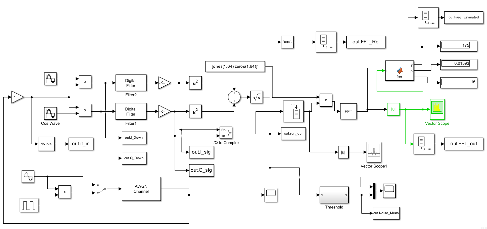

# FPGA-based Digital IF Frequency Estimator

A real-time FPGA implementation of a digital IF frequency estimator using 128-point FFT, CORDIC, and parabolic interpolation.

---

## 📋 Overview

This project implements a **real-time digital frequency estimator** for IF (Intermediate Frequency) signals on an FPGA. The system:

1. **Receives** a 14-bit digital IF signal sampled at 128 MHz
2. **Demodulates** the signal into I/Q components
3. **Detects** the pulse using envelope detection and adaptive thresholding
4. **Computes** the 128-point FFT of the detected pulse
5. **Estimates** the frequency using parabolic interpolation

The design follows a **two-stage methodology**:
- **Stage 1:** MATLAB/Simulink quantized reference model
- **Stage 2:** Synthesizable VHDL implementation

---

## 🏗️ System Architecture

The block diagram of the system is shown below:

  

### Signal Flow

1. **IF Signal** → 14-bit digital input at 128 MHz
2. **IQ Demodulator** → Splits signal into I and Q components
3. **Amplitude (SQRT)** → Computes envelope `√(I² + Q²)` using CORDIC
4. **Noise Mean Calculator** → Estimates average noise level
5. **Threshold** → Adaptive threshold = Noise Mean × Coefficient
6. **Comparator** → Detects pulse when envelope > threshold
7. **Delay Line** → Compensates for 30-cycle detection latency
8. **FFT (128-point)** → Computes spectrum of the detected pulse
9. **Amplitude (SQRT)** → Computes FFT magnitude using CORDIC
10. **Max & Interpolation** → Finds peak and estimates exact frequency

---

## 📐 MATLAB Reference Model

The system is first modeled in **MATLAB/Simulink** with **fixed-point quantization** to verify the algorithm before HDL implementation.

  

### Model Components

| Block | Description |
|:---|:---|
| **IQ Demodulator** | Multiplies IF by cos/sin at 32 MHz |
| **Low-Pass Filter** | 5th-order IIR Butterworth filter |
| **Amplitude (SQRT)** | Computes `√(I² + Q²)` |
| **Noise Mean** | Low-pass filter for noise estimation |
| **Threshold** | Adaptive threshold = Noise Mean × 0.5 |
| **FFT** | 128-point FFT with no scaling |
| **Amplitude (SQRT)** | CORDIC-based magnitude |
| **Max & Interpolation** | Parabolic interpolation |

### Parabolic Interpolation

The exact frequency is calculated using:

Where:
- `a` = magnitude at bin `k-1`
- `b` = magnitude at bin `k` (peak)
- `c` = magnitude at bin `k+1`
- `k` = index of maximum magnitude
- `fs/N` = 1 MHz (frequency resolution)

---

## 💻 VHDL Implementation

The verified algorithm is implemented in **synthesizable VHDL** using Xilinx IP cores.

### Key Sub-Modules

| Module | Description |
|:---|:---|
| **IQ_Demodulator** | I/Q demodulation with digital mixer |
| **Low_Pass_Filter** | 5th-order IIR filter |
| **Delay_Line** | 30-cycle delay for I/Q |
| **Interpolation_divider** | Frequency interpolation |

### IP Cores

| IP | Description | Configuration |
|:---|:---|:---|
| **FFT_128** | 128-point FFT | Pipelined Streaming, 128 MHz |
| **Amp_SQRT** | CORDIC for baseband amplitude | Translate, 22-bit |
| **FFT_SQRT** | CORDIC for FFT amplitude | Translate, 22-bit |
| **interpolation** | Divider for parabolic interpolation | Fractional, 16-bit |

---

## 📊 System Specifications

| Parameter | Value |
|:---|:---|
| **Sampling Frequency** | 128 MHz |
| **IF Center Frequency** | 160 MHz |
| **Bandwidth** | 40 MHz |
| **Input Resolution** | 14-bit signed (fix14_13) |
| **FFT Length** | 128 points |
| **FFT Resolution** | 1 MHz |
| **Minimum Pulse Width** | 200 ns |
| **Input SNR** | ≥ 15 dB |
| **FFT Latency** | 3.6 µs |
| **Target Device** | Xilinx Zynq UltraScale+ (xczu9eg-ffvb1156-2-i) |

---

---

## ⚡ Power Analysis

| Parameter | Value |
|:---|:---|
| **Total On-Chip Power** | 1.04 W |
| **Dynamic Power** | 0.417 W (40%) |
| **Device Static** | 0.623 W (60%) |
| **Junction Temperature** | 26.0°C |
| **Thermal Margin** | 74.0°C |

**Breakdown of Dynamic Power:**
- **I/O**: 0.234 W (56%)
- **Logic**: 0.072 W (17%)
- **Signals**: 0.057 W (14%)
- **Clocks**: 0.031 W (7%)
- **DSP**: 0.020 W (5%)
- **BRAM**: 0.003 W (1%)

---

## 🚀 Quick Start

### Prerequisites

- **Xilinx Vivado** 2023.x or later
- **MATLAB** R2023a or later (for reference model)

### 1. Clone the Repository

